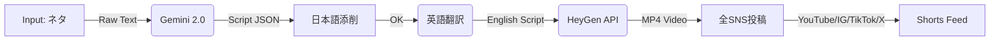

# 完E自動化ワークフロー (Video Automation Factory) - 決定版

## 戦略皁E宁E(Strategic Decision)
**「HeyGen一択」で構築します、E*

*   **Q:** HeyGenだけで行けるかEE
*   **A:** **行けます、E* 音声(TTS)、アバター(Visual)、口パク(Lip-sync)、字幁ECaptions)めE*1回EAPIコール**で完結できる唯一のプラチEフォームだからです、E
*   **琁E:** 他ツールEElevenLabs + CapCut等）をパズルのように絁E合わせると、エラー玁E上がり、E動化が「よく止まる機械」になってしまぁEす。Optimizationの観点から**HeyGenへの一本匁E*が正解です、E

## 確定ワークフロー (The Flow)

最もシンプルで堁Eなルートです、E



## 吁EチEプE役割

### Step 1: Input (トリガー)
*   **Action**: あなたがチャチEで「トピックE例：アメリカの栁Eガイドライン変更E」を投げるだけ、E

### Step 2: Gemini 2.0 (脚本生E)
*   **Action**: 
    1.  **タスクタイプ判断**: タスクタイプを判断EEook生E / スクリプト生E / 字幕指宁E/ 画像選宁E/ 公開形式！E
    2.  **重要Rules抽出**: そEタスクタイプに応じたルール群から「重要なもE」上位N個を「忁Eルール」として抽出
    3.  **アイチE技況E6適用**: 忁EアイチE技況E6を適用し、技法名をE訁E
    4.  `VIDEO_STRATEGY_FINAL.md` に基づく「NEO構E」E台本を書く（日本語）、E
    5.  固定コメント（テンプレート）を生E、E
    6.  議論誘発コメント（動画ごとEを生E、E
    7.  **重要RulesチェチE**: 重要RulesをチェチE ↁE1つでも❌ ↁE修正提桁E+ 再チェチE ↁE全て✁Eで繰り返す

### Step 3: 日本語添削（ユーザーチェチEEE
*   **Action**:
    1.  ユーザーが日本語スクリプトをチェチE、E
    2.  口調、ニュアンス、表現を修正、E
    3.  OKがEるまで繰り返し、E

### Step 4: 英語翻訳
*   **Action**: 
    1.  日本語版が確定したら、英語に翻訳、E
    2.  HeyGen用の英語スクリプト作E、E
    3.  **現在E手動使用EE*: HeyGen UIに貼り付ける用のスクリプトは、読みめEぁE式（改行あり）で作Eすること、ESONには`script_en`E読みめEぁE式、手動用Eを保存すること、E
    4.  **封EEEPI使用EE*: HeyGen APIで使ぁEクリプトは、改行！E\n`Eを削除し、E続したテキストとして作Eすること、ESONには`script_en_heygen`EEeyGen API用、改行なし）も保存すること、E
    5.  英語版コメント（固宁E+ 議論誘発E作E、E
    6.  **【忁E】コピE用出劁E*: 英語スクリプトとHeyGen設定を**忁E一緒に**コピE用として出力すること。以下E形式で出力！E
        ```
        **スクリプトEEeyGen UIに貼り付けEE*:
        [英語スクリプト]

        **HeyGen設定（スクリプト以外E持EE容EE*:
        [設定E容]

        **HeyGen実行前の確認事頁E日本語！E*:
        [確認事頁E
        ```
    7.  **【忁E】字幕重なり防止**: スクリプト生E時に以下Eルールを適用することEE
        - 吁Eクション間に**0.5秒EポEズ**をEれるE侁E `... (pause 0.5s) ...`EE
        - 長ぁEリフE**8秒以冁E*で刁Eする
        - 研究引用の字幕E、前の字幕が消えてから表示されるよぁEする
        - スクリプト冁E自然な区刁EE句読点、段落Eを活用し、字幕Eタイミングを調整する
    8.  **【忁E】背景画像E持EE*: 解説系動画では、トピックに応じぁE*リアルな背景画僁E*を指定すること、EeyGen設定に以下を含めるEE
        - **背景画像E具体的な持EE*: トピチEに応じたリアルな画像（侁E レクチン→Eのリアルな解剖図、シュウ酸→E臓Eリアルな解剖図EE
        - **優先頁EE*: 最優允E リアルな人体解剖図・臓器の実E、次点: 3DモチE・VRモチE、Eける: 参老E像的なもE・簡略なイラスチE
        - **注意点**: リアルタイム解剖図は具体例E1つであり、これに引っ張られすぎなぁE想像しめEくするためE補助として使用、E

### Step 5: HeyGen (製造)
*   **現在E手動使用EE*: 
    1.  **完E形持EチEプレートE使用**: `second-brain/HEYGEN_COMPLETE_INSTRUCTIONS.md`を参照し、完E形持Eを作Eすること、E
    2.  **映像E変化**: スクリプトと同じ冁Eで、動画のシーンに変化をたくさんEれること、E
    3.  **静止画は避ける**: カレンダーなどの静止画は惁E量が増えなぁEめEける。動く映像！Eooms, pans, animationsEを使用すること、E
    4.  **惁E量E確俁E*: ただ動いてぁEだけではダメ。映像から得られる惁Eが変化する忁Eがある。各シーンで新しい惁Eを提供すること。！E*⚠EE重要E*: これはユーザー個人の意見であり、データに基づくものではなぁEE世界の総意ではなぁEE
    5.  **B-roll持E**: Stock media中忁EダイナミチE変化多めEEuick cuts 1-3秒ごと、zooms/pans、E繁なシーンチェンジE、E
    6.  **Unlimitedプラン準拠**: Avatarなし！Eoiceover onlyE、Generic male voice、Stock mediaのみEEI生EメチEアは使用不可E、E
    1.  **【忁E】スクリプトとHeyGen設定を一緒にコピE**: Step 4で出力された「スクリプトEEeyGen UIに貼り付けE」と「HeyGen設定（スクリプト以外E持EE容E」を**忁E一緒に**コピEして使用すること、E
    2.  JSONの`script_en`をコピEしてHeyGen UIに貼り付ける、E
    3.  HeyGen設定に従って、アバターEなし）、E声E英語）、背景E動画の冁Eに合わせてE、字幕（有効化）を設定する、E
    4.  **【忁E】背景画像E持EE*: 解説系動画では、参老E像的なもEではなく、E*リアルな画僁E*E人体解剖図、臓器、E、E臓などEを背景として持Eすること、EeyGen UIで背景画像を選択する際は、以下E優先頁Eで選択！E
        - **最優允E*: リアルな人体解剖図、臓器の実E、医学皁Eラスト（リアル系EE
        - **次点**: 3DモチE、VRモチEEE場感EあるもEEE
        - **避ける**: 参老E像的なもE、簡略なイラスト、抽象皁E画僁E
        - **具体侁E*: レクチンの話 ↁE腸のリアルな解剖図、シュウ酸の話 ↁE腎臓のリアルな解剖図、フィチン酸の話 ↁEミネラル吸収を示すリアルな図
    4.  **HeyGen実行前の確認事頁E日本語！E*を確認してから、動画を生成する、E
    5.  **字幕重なり防止の確誁E*: HeyGen UIで字幕Eタイミングを確認し、EなってぁEぁEチェチEする。重なってぁE場合E、スクリプトにポEズを追加する、E
    6.  完パケ動画EEP4Eをダウンロードする、E
*   **封EEEPI使用EE*: 
    1.  JSONの`script_en_heygen`をHeyGen APIに送信、E
    2.  持Eされたアバターと音声で喋らせる、E
    3.  同時に「字幕」も焼き付ける、E
    4.  完パケ動画EEP4Eを出力する、E

### Step 6: 全SNS投稿 (配信)
*   **Action**: 
    1.  完Eした動画めE*自動投稿プラチEフォーム**に同時投稿EEプラチEフォーム: YouTube, Instagram, TikTok, Facebook, LinkedIn, PinterestE、E
    2.  固定コメントをピン留め、E
    3.  議論誘発コメントを投稿、E
    4.  **X (Twitter)は手動投稿**E参照: `second-brain/SNS_手動投稿リスチEmd`EE

---

## 📱 投稿対象SNSEE026年牁E- 全プラチEフォーム使用EE

### **全プラチEフォームEEつすべて使用EE*

1.  **YouTube Shorts** ✁E
    - 最大60私E
    - 縦型動画EE:16EE
    - 検索エンジン連携で長期的発見性あり
    - API: YouTube Data API v3E無料枠ありEE

2.  **Instagram Reels** ✁E
    - 最大90私E
    - 縦型動画EE:16EE
    - 購買行動に繋がりやすい
    - API: Instagram Graph APIE無料！E

3.  **TikTok** ✁E
    - 推奨15-60秒（最大3刁EE
    - 縦型動画EE:16EE
    - 拡散性が最も高い
    - API: TikTok APIE無料！E

4.  **X (Twitter)** ✁E**E手動投稿EE*
    - 動画投稿可能E最大2刁E0秒！E
    - チEストとの絁E合わせで拡散
    - **自動化除夁E*: 手動で投稿E手動でもやる価値があるくらい重要EE
    - 参E: `second-brain/SNS_手動投稿リスチEmd`

5.  **Facebook Reels** ✁E
    - 最大90私E
    - 年齢層が高めEE0-50代EE
    - API: Meta Graph APIE無料！E

6.  **LinkedIn** ✁E
    - ビジネス層向け
    - 健康・パフォーマンス系は相性良ぁE
    - API: LinkedIn APIE無料！E

7.  **Pinterest** ✁E
    - 縦型動画対忁E
    - 女性ユーザー多め
    - API: Pinterest APIE無料！E

---

## 忁EなもE (Requirements)
1.  **HeyGen API Key** (Enterprise/Pro) ※これさえあれば勝てます、E
2.  **Gemini API Key** (OK)
3.  **各SNSアカウンチE* (YouTube, Instagram, TikTok, X, Facebook, LinkedIn, Pinterest)
4.  **Supabase Functions** (自動投稿シスチE構篁E
5.  **各SNS API Keys** (全て無料で取得可能)

---

## 次のスチEチE
1.  **Agent 1**: 過激HookコンチEチE成！E/21、E/3、E日3本EE
2.  **Agent 2**: SNS自動投稿シスチE構築！Eupabase FunctionsEE
3.  **統合テスチE*: Agent 1のコンチEチEↁEAgent 2の自動投稿

## Agent刁E

- **Agent 1**: 過激HookコンチEチE戁E
  - ニュース/トレンド収雁E
  - Hook生EE「野菜E毒！」系EE
  - 科学皁E拠の絁E込み
  
- **Agent 2**: SNS自動投稿シスチE
  - Supabase Functions構篁E
  - 全7プラチEフォームへの自動投稿
  - API統合EチEEロイ

詳細は `second-brain/AGENTS/AGENT_2_SNS_AUTOMATION_HANDOFF.md` を参照、E

